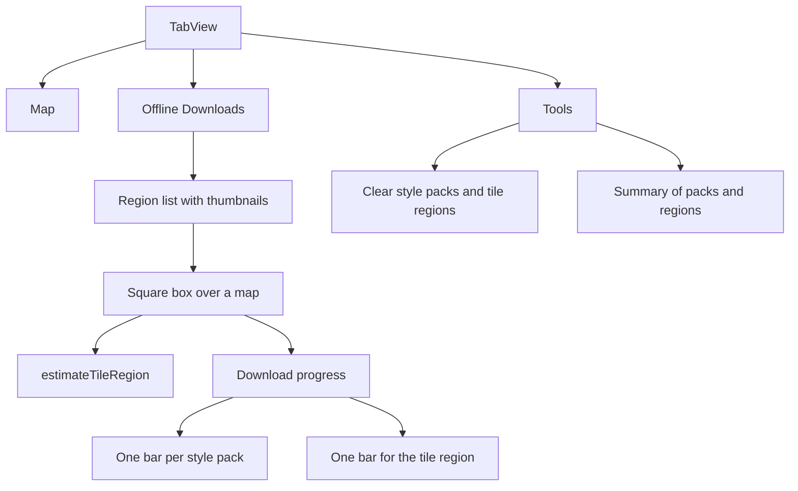

# Mapbox Offline Test App Plan

This is the working plan for the Mapbox offline test app. Implementation happens in later passes, following the phases below.

The app lives in [MapboxOfflineTest/MapboxOfflineTest](MapboxOfflineTest/MapboxOfflineTest). Today it is a SwiftUI template: [MyApp.swift](MapboxOfflineTest/MapboxOfflineTest/MyApp.swift) and [ContentView.swift](MapboxOfflineTest/MapboxOfflineTest/ContentView.swift) (`Text("Hello, world!")`). The Xcode project uses a synchronized root group, so new Swift files under that folder are picked up automatically. Deployment target is iOS 27. The target currently also lists macOS and visionOS; Mapbox Maps is an iOS SDK, so the target will be limited to iPhone and iPad.

## What the Mapbox docs require

Offline rendering needs two independent downloads, both stored in one `TileStore`:

- **Style pack** (`OfflineManager.loadStylePack`): style JSON, sprites, fonts, and other non-tile assets. Small (usually a few MB). One pack per style URI, shared by every region.
- **Tile region** (`TileStore.loadTileRegion`): a geometry, a zoom range, and one or more tileset descriptors. The SDK expands that into tile packs. You do not download tile packs one by one. A region is the thing you create, list, and delete.
- **Tile packs** are an internal grouping. Zoom requests snap to fixed bands (0–5, 6–10, 11–14, 15–16), so a request for zoom 8–15 actually stores 6–16. Cumulative unique tile packs cannot exceed 750.

v11 removed `TilesetDescriptorOptionsForTilesets`. Granular sources are the `tilesets` argument on `TilesetDescriptorOptions`. Each entry is a `mapbox://` TileJSON URI (for example `mapbox://mapbox.mapbox-streets-v8`). When `tilesets` is set, those sources are what get downloaded. When it is nil, the SDK downloads every source in the style. `styleURI` is still a required field on the descriptor; it does not decide the tile list if `tilesets` is provided. Style packs are downloaded with `loadStylePack` and `stylePackOptions` stays nil on the descriptor, so style downloads stay separate from tile downloads.

Size estimates use `TileStore.estimateTileRegion`, which returns `transferSize`, `storageSize`, and `errorMargin`. That estimate is for the tile region (the bounding box plus the explicit tilesets plus the zoom range). Style packs are not part of the box estimate; their size shows up on `StylePack.completedResourceSize` after `loadStylePack`.

Listing APIs are `OfflineManager.allStylePacks` and `TileStore.allTileRegions`, plus `tileRegionMetadata` and `tileRegionGeometry`. There is no public API that lists individual tile packs. The summary page will show style packs, and tile regions (each region’s byte size and polygon area). The UI will label regions as the download that contains the tile packs.

`removeStylePack` and `removeTileRegion` can defer disk deletion. A full clear sets `TileStoreOptions.diskQuota` to `0` so eviction actually runs, then clears the quota so later downloads work.

The map reads the store when `MapboxMapsOptions.tileStore` is the same `TileStore` used for downloads and `tileStoreUsageMode` is `.readOnly` (the default). Offline drawing only works for style layers whose sources were actually downloaded.

Progress callbacks are not on the main thread. UI updates hop to `MainActor`.

## App shape



- **Map:** a `Map` using the first style in config, backed by `TileStore.default`, so downloaded regions render. A style picker switches among the configured style URLs.
- **Offline Downloads:** list of tile regions. Each row shows a thumbnail, name, byte size, and area. A button pushes the region picker.
- **Region picker:** map with a fixed square mask. Pan and zoom move the map under the square. The four corners of the square become a polygon via `map.coordinate(for:)`. Min and max zoom sliders (default 11...14, range 0...16) sit under the map, with a short note that Mapbox snaps to tile-pack bands. Idle camera movement debounces `estimateTileRegion` and shows transfer size and storage size. Confirm starts the download.
- **Download progress:** one progress bar per configured style pack (`completedResourceCount / requiredResourceCount` and bytes), and one bar for the tile region. Downloads run together. `loadStylePack` is safe to call again; an existing pack refreshes instead of duplicating. Cancel uses the returned `Cancelable` values.
- **Tools:** confirm-then-clear for every style pack and tile region, including thumbnails and a quota-zero eviction. A second button opens the summary.
- **Summary:** style packs (URI and `completedResourceSize`) and tile regions (name, `completedResourceSize`, area in km² from the stored polygon via Turf `area`, zoom range, and the source URL list).

## Download behavior

Config lives in `OfflineConfig.swift`, not in the download call sites:

- `styleURIs`: style pack URLs, for example `mapbox://styles/mapbox/streets-v12` and `mapbox://styles/mapbox/outdoors-v12`. Every entry is passed to `loadStylePack`.
- `tilesetURLs`: source URLs, for example `mapbox://mapbox.mapbox-streets-v8` and `mapbox://mapbox.mapbox-terrain-v2`. These are the only tilesets on the descriptor.

One tileset descriptor is built as:

```swift
TilesetDescriptorOptions(
    styleURI: StyleURI(rawValue: OfflineConfig.styleURIs[0])!,
    zoomRange: selectedZoom,
    tilesets: OfflineConfig.tilesetURLs
)
```

`TileRegionLoadOptions` gets the square’s polygon, that descriptor, `acceptExpired: false`, and JSON metadata: name, created date, min zoom, max zoom, and the tileset URL list. Region id is a UUID.

On confirm, before the download starts, `Snapshotter` captures the square and writes `Documents/offline-thumbnails/{id}.jpg`. The list loads that file. If it is missing, the row shows a placeholder.

A single `OfflineRepository` (`Observable`) owns `OfflineManager()` and `TileStore.default`, publishes regions, style packs, estimates, and in-flight progress, and is created once in `MyApp` and passed into the tabs.

## SDK setup

- Swift package `https://github.com/mapbox/mapbox-maps-ios` at exact version **11.31.0**, product `MapboxMaps`.
- Limit `SUPPORTED_PLATFORMS` to `iphoneos iphonesimulator` and `TARGETED_DEVICE_FAMILY` to iPhone and iPad.
- Runtime token via generated Info.plist key `MBXAccessToken`, fed by a gitignored `Secrets.xcconfig` (`MBX_ACCESS_TOKEN = pk...`) plus `Secrets.xcconfig.example`. The token is not committed. License setup is out of scope.
- Remove the template `import Playgrounds` block when `ContentView` is replaced.

## Phases to build later

1. Package, iOS-only target, token xcconfig, `OfflineConfig.swift`, empty tab shell.
2. `OfflineRepository` plus the Map tab wired to the shared tile store and style picker.
3. Downloads list, square region picker, debounced `estimateTileRegion`, thumbnail snapshot.
4. Parallel style-pack and tile-region download with separate progress bars and cancel.
5. Tools: clear-all (quota-zero eviction) and the summary page (style pack sizes, region byte size, km²).

## Checks once it is built

- A small zoom-11–14 box estimates a non-zero transfer size before download.
- Progress shows one bar per style URL and one tile-region bar, and both complete.
- The region appears in the list with a thumbnail, name, bytes, and area.
- The Map tab, set to a configured style whose sources are in `tilesetURLs`, still draws that box in airplane mode.
- Summary matches `allStylePacks` and `allTileRegions`.
- Clear-all removes packs, regions, and thumbnails, and a later download still works.
